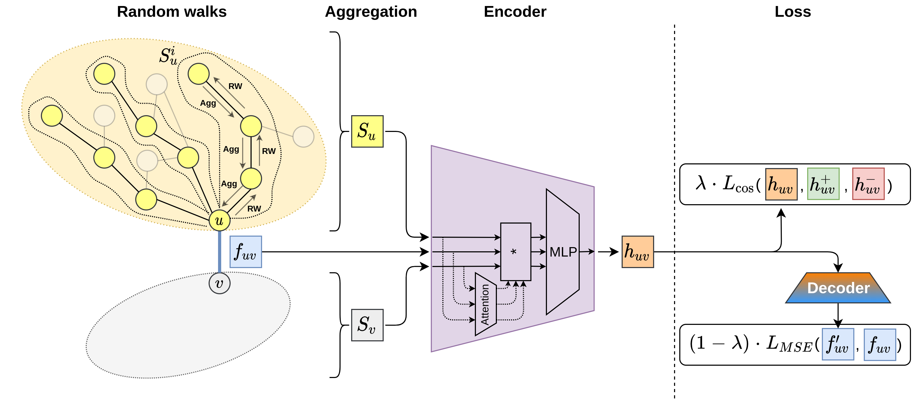

# AttrE2vec
This is the official implementation of the AttrE2vec (Attributed Edge 2 vector) 
method, which is designed to obtain low-dimensional representation vectors for
edges in graphs. 



We observe that for each edge $(u, v)$ we can distinguish two neighborhoods:
one "behind" node $u$ and one behind $v$. Each of those neighborhoods is sampled
using uniform random walks over edges, and the information of the a single random
walk (features of encountered edges) is aggregated using one of the following 
methods:
- **Avg** – average aggregation
- **Exp** – exponential aggregation (more distant edges are less important)
- **GRU** - recurrent neural network taking only edge features into account
- **ConcatGRU** - recurrent neural network taking into account both node and edge features

The aggregated information of a single random walk is the averaged over all walks
in a single neighborhood to obtain the neighborhood summary $S_u$ (and $S_v$, 
respectively).

The neighborhood summaries and the features of the current edge are passed into
the encoder module, which consists of a custom self-attention mechanism and fully
connected layers.

Our proposed model relies on a hybrid cost function that includes:
- a contrastive learning objective based on the cosine similarity of edge representations
- an edge feature reconstruction loss

As the model learns the parameters of a transformation function, the model is 
fully inductive.

# Running the code
We use Python 3.7 to implement our model and experiments. Please refer to the
`requirements.txt` file to install the required packages.

Our experimental pipeline is based on DVC (Data Version Control). You can get
all pipeline artifacts using the `dvc pull` command. If needed, pipeline stages
can be reproduced using the `dvc repro <stage-name>` command.

# Citation
If you make use of AttrE2vec in your research, please cite it using the following entry:

```
@article{BIELAK2022,
    title = {AttrE2vec: Unsupervised Attributed Edge Representation Learning},
    journal = {Information Sciences},
    year = {2022},
    issn = {0020-0255},
    doi = {https://doi.org/10.1016/j.ins.2022.01.048},
    url = {https://www.sciencedirect.com/science/article/pii/S0020025522000779},
    author = {Piotr Bielak and Tomasz Kajdanowicz and Nitesh V. Chawla},
}              
```


## License
MIT